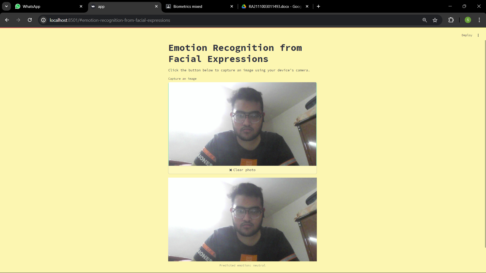

# Emotion Detection from Facial Expressions using MediaPipe and TensorFlow

This project is an interactive application that detects human emotions from facial expressions using **MediaPipe FaceMesh** for facial landmark detection, **TensorFlow/Keras** for classification, and **Streamlit** for real-time webcam-based emotion recognition.

---

## 📌 Features

- 🔍 Detects facial landmarks using **MediaPipe**
- 📐 Extracts 2D and 3D distances from key facial features (eyes, eyebrows, lips) relative to the nose
- 🧠 Trains a neural network on FER emotion dataset
- 📷 Runs a live webcam app using **Streamlit**
- 🎯 Predicts one of several emotions (e.g., Happy, Sad, Angry, etc.)

---

## 📁 Dataset

- Dataset used: [FER2013 - Facial Expression Recognition](https://www.kaggle.com/datasets/msambare/fer2013)

---

## 📸 Sample Output

